# XCRM – Mini CRM Platform  
_🚀 Xeno SDE Internship Assignment – 2025_

Hi there! 👋  
Thank you for reviewing my submission for the Xeno SDE Internship Assignment. This Mini CRM platform includes customer segmentation, personalized campaign creation, AI-based suggestions, and delivery tracking.

---

## 📚 Table of Contents

- [🖥️ Screenshots](#️-screenshots)
- [🏗️ Architecture Diagram](#️-architecture-diagram)
- [📝 Local Setup Instructions](#️-local-setup-instructions)
- [🌐 Deployment](#️-deployment)
- [🔐 Authentication](#️-authentication)
- [🤖 AI Tools Used](#️-ai-tools-used)
- [✅ Assignment Checklist](#️-assignment-checklist)
- [⚡ Known Limitations & Assumptions](#️-known-limitations--assumptions)
- [📄 API Documentation](#️-api-documentation)
- [🧠 Assignment Reflection](#️-assignment-reflection)
- [📹 Demo Video](#️-demo-video)
- [👋 Thank You!](#️-thank-you)

---

## 🖥️ Screenshots

### 🔐 Login Page
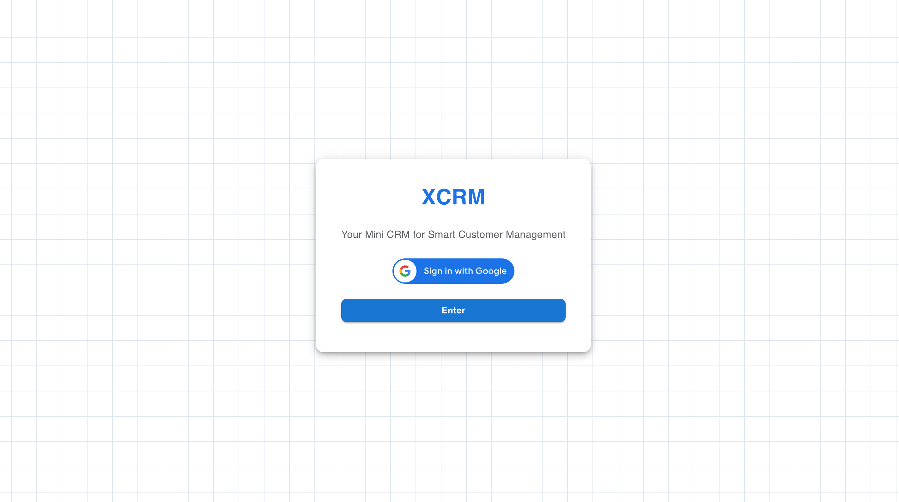

### 🏠 Home Page – Features
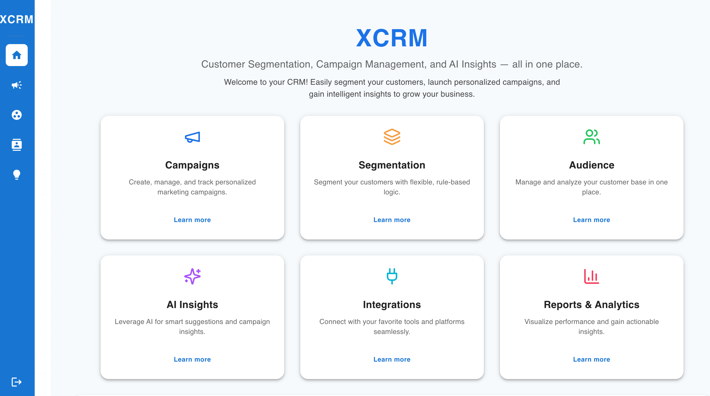


### 🔔 Home Page – Notifications
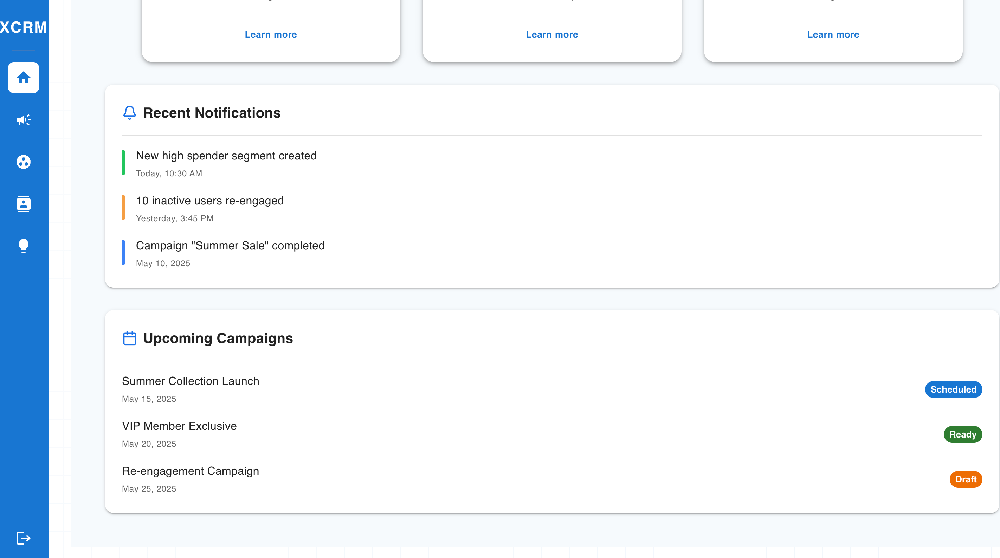

### 📊 Campaigns Table
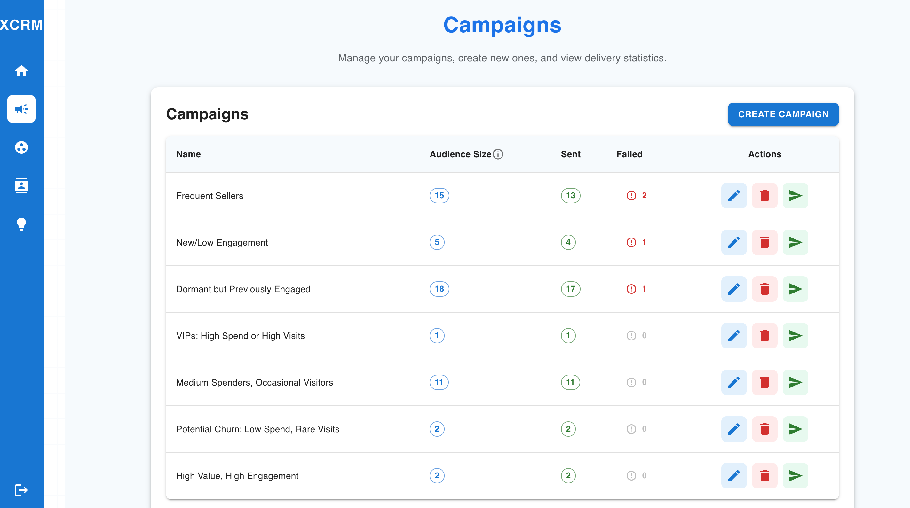

### ✍️ Campaign Creation


### ❌ Campaign Deletion
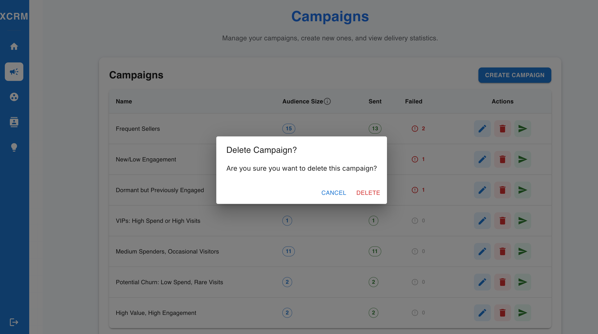

### 📩 Message Sending Simulation
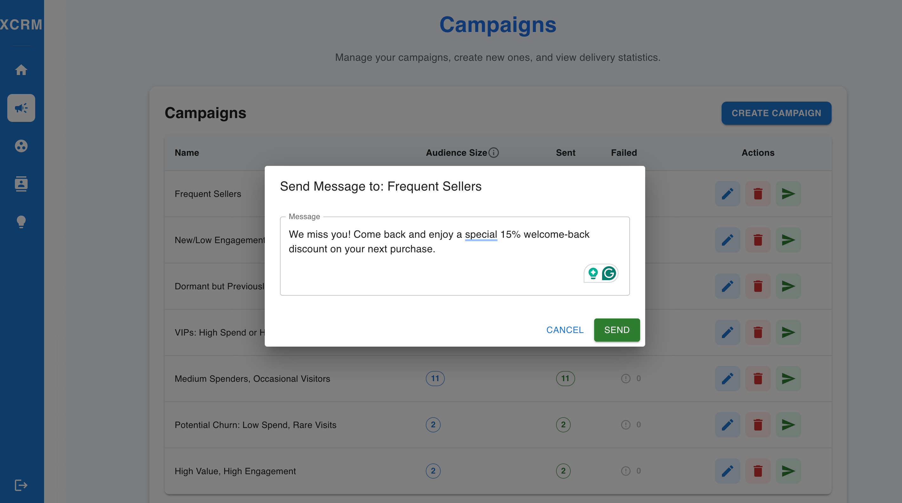

### 🧠 Customer Segmentation – View 1
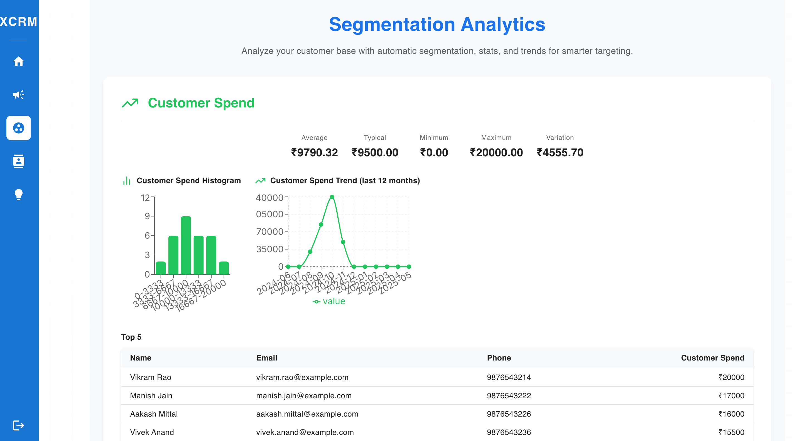

### 🧠 Customer Segmentation – View 2
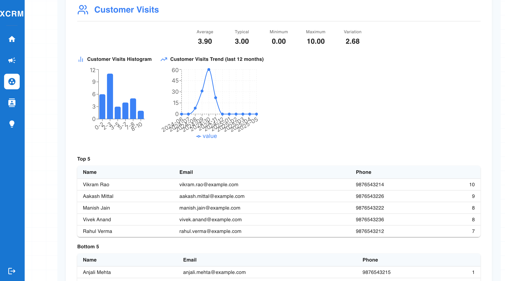

### 🧠 Customer Segmentation – View 3
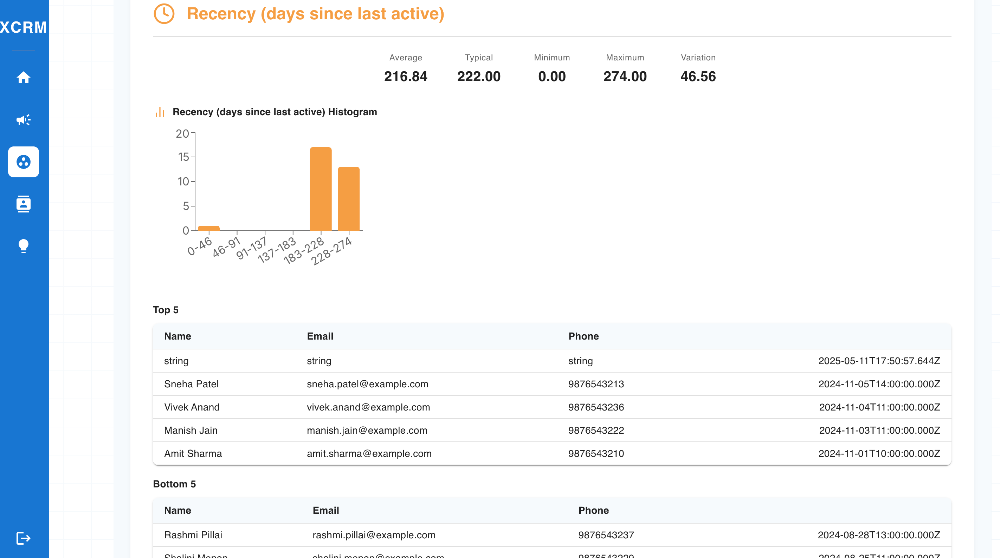

### 👥 Audience View – 1
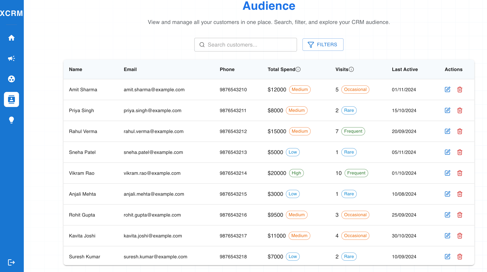


### 🤖 AI Campaign Suggestion
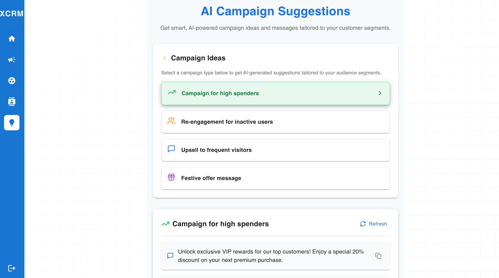
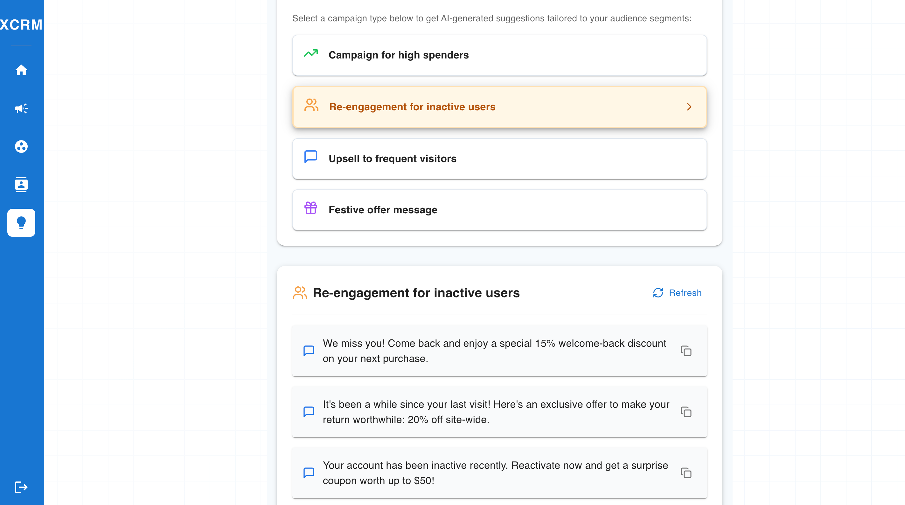

---

## 🏗️ Architecture Diagram

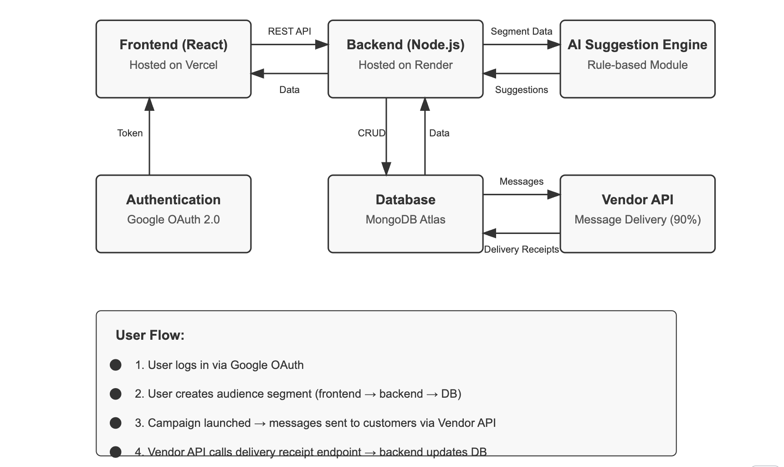

---

## 📝 Local Setup Instructions

### 1. Clone the Repository

```sh
git clone https://github.com/raagavi2105/X_CRM.git
cd XCRM
```

### 2. Backend Setup

```sh
cd backend
npm install
# Configure your .env file with:
# MONGODB_URI, PORT, etc.
npm start
# Visit: http://localhost:4000/api-docs for Swagger API docs
```

### 3. Frontend Setup

```sh
cd ../frontend
npm install
# Set up your .env file with:
# REACT_APP_API_URL=http://localhost:4000
npm run dev
# App runs at: http://localhost:5173
```

---

## 🌐 Deployment

- **Frontend:** [Vercel](https://xcrm-mini.vercel.app/)
- **Backend:** [Render](https://x-crm.onrender.com)
- **DataBase:** [MongoDB]
- **API Docs:** `/api-docs` route on backend

---

## 🔐 Authentication

- Google OAuth 2.0 authentication
- Only authenticated users can create/view campaigns and segments
- A guest/demo mode is available using the **"Enter"** button

---

## 🤖 AI Tools Used

- **AI Campaign Message Suggestions:**
  - Implemented with a **rule-based system**.
  - Future-ready for OpenAI, Vertex AI, or similar integrations.
  - Example: For an "inactive user" segment, the system suggests:  
    _"We miss you! Enjoy 15% off to return."_

---

## ✅ Assignment Checklist

| Requirement                              | Status      | Notes |
|------------------------------------------|-------------|-------|
| Data Ingestion APIs                      | ✅ Completed | Swagger UI used |
| Campaign UI + Rule Builder               | ✅ Completed | Dynamic rule-based builder with AND/OR |
| Campaign Delivery & Logging              | ✅ Completed | Simulated delivery with logging |
| Google OAuth Authentication              | ✅ Completed | Firebase integration |
| AI-Powered Feature                       | ✅ Completed | Rule-based suggestion engine |
| Pub-Sub Architecture (Kafka, etc.)       | ❌ Skipped   | Explained in limitations |

---

## ⚡ Known Limitations & Assumptions

- **Pub/Sub Not Implemented:**  
  Kafka or message brokers were skipped due to scope and deployment constraints.

- **AI Features are Rule-Based:**  
  No LLM used due to cost & time constraints. Easily extendable.

- **Security:**  
  Minimal validation & OAuth only. Not production-hardened.

- **Demo Dataset:**  
  Sample customer and order data provided for functionality testing.

- **Scalability:**  
  App is not optimized for high-traffic scenarios—designed for demo/assignment scale.

---

## 📄 API Documentation

- Swagger UI is available at:  
 
  [https://xcrm-qleo.onrender.com/api-docs](https://x-crm.onrender.com/api-docs)

---


## 👋 Thank You!

Thank you for the opportunity!  
If you have any questions or feedback, feel free to reach out on [GitHub](https://github.com/raagavi2105).

**🚀 Let’s build the future of CRM!**
